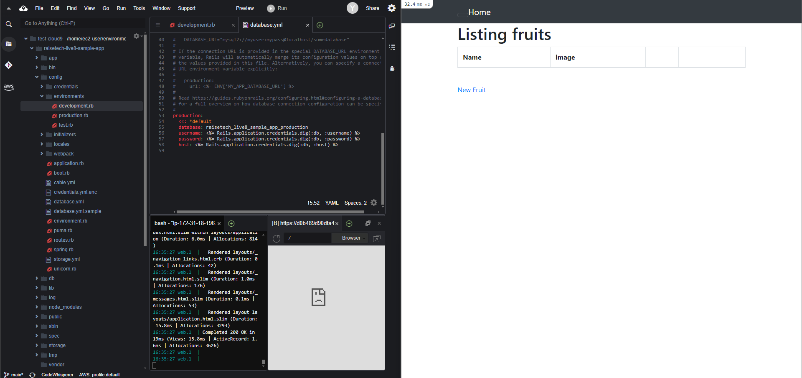
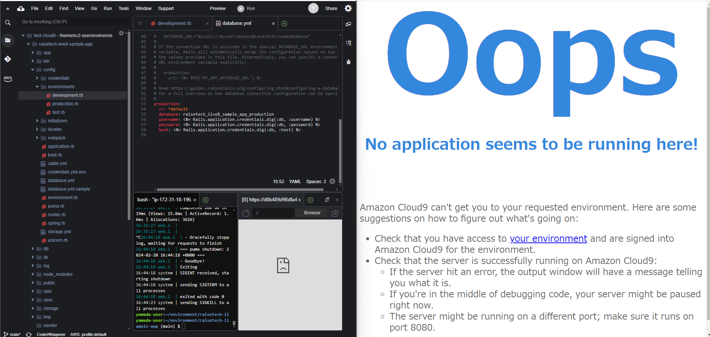
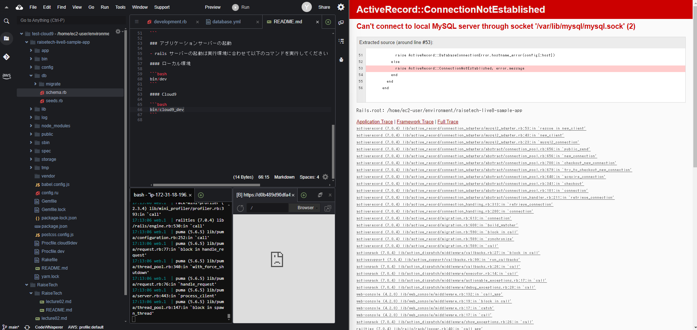

# lectre03

## APサーバー
APサーバー名：Puma
バージョン：5.6.8
APサーバー起動

APサーバー終了後、アクセスできない

## DB：サーバー
DBサーバー名：MySQL
バージョン：8.0.36
DBサーバー停止後、アクセスできない

## 所感
数か月ぶりに学習を再開したので、
gitの操作に手間取ってしまった。
アプリのデプロイに関しては問題はなかった。